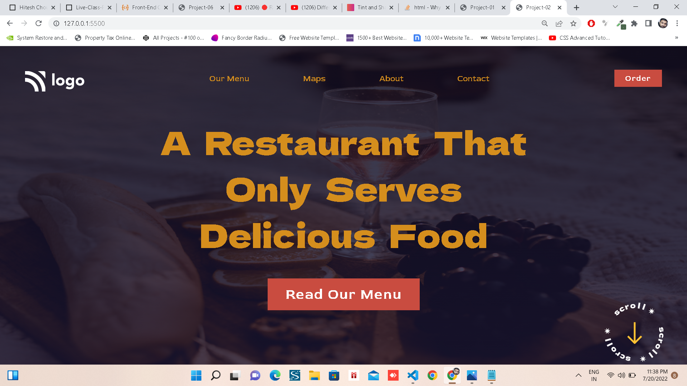

# __Project-02 Food Restaurant Home Page__

## _Name: Aditya Bankar_

> Second Project :
It is a simple Home Page of a Resturant with a big gigantic Quote about there thought.

> In this HTML Home page, I basically learnt 3 main things:
- Background-size (i.e How to use background-size properties like : cover, 100% 100%, contain)
- background: linear-gradient to apply opacity to background
- font-size (How to apply font-size to entire page)
----

Once again Thank You Hitesh Sir....

